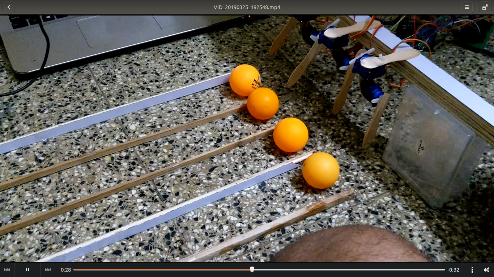
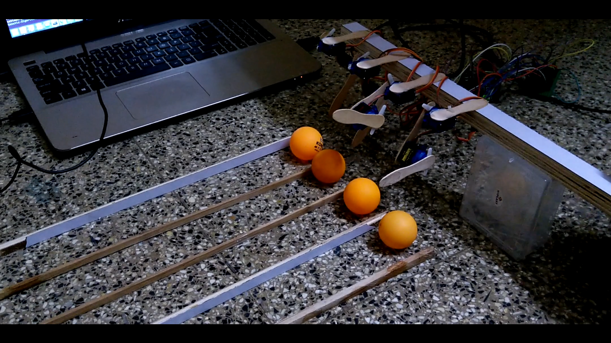
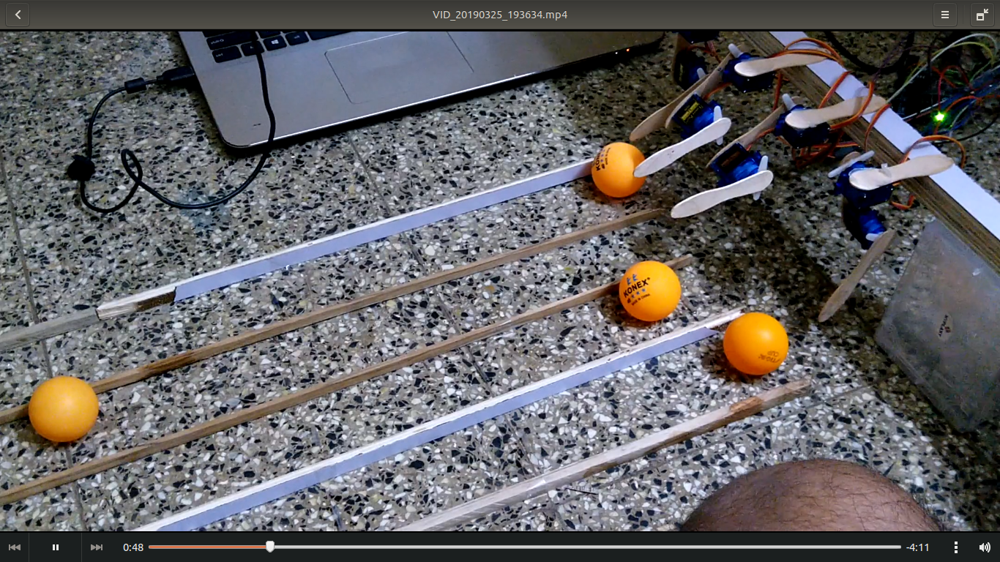
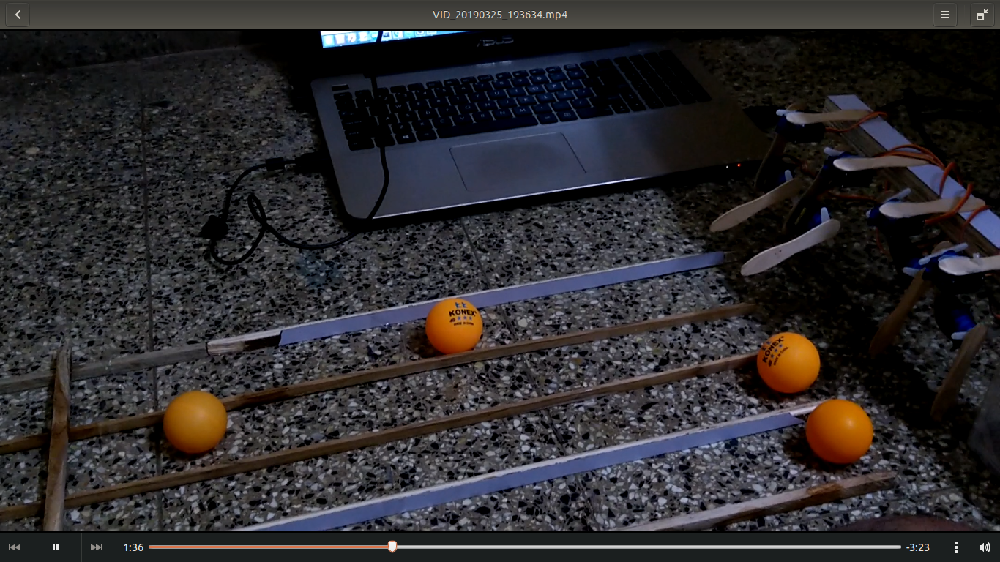
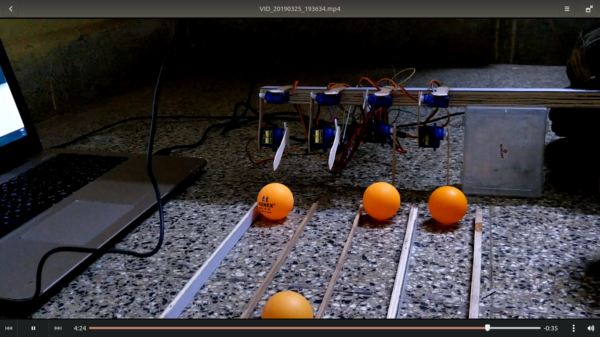

# Learning-To-Kick-Using-Genetic-Algorithms

In this project I have used genetic algorithms to teach a servo powered leg, how to kick a ball.

# Some screenshots
</img>
</img>
</img>
</img>
</img>

# References:
1. [The coding train](https://www.youtube.com/watch?v=9zfeTw-uFCw&list=PLRqwX-V7Uu6bJM3VgzjNV5YxVxUwzALHV)
2. [The Nature of Code by Daniel Shiffman](https://natureofcode.com/)